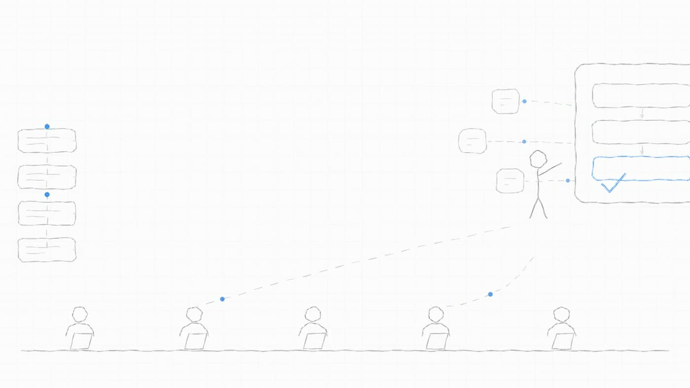
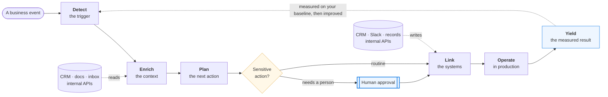
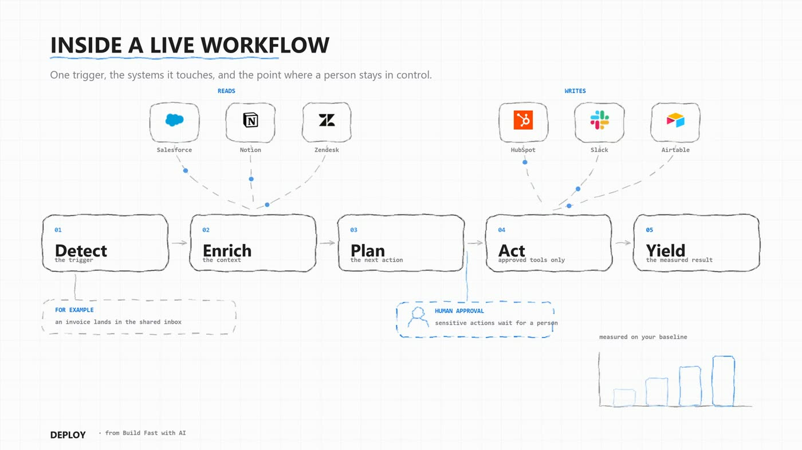
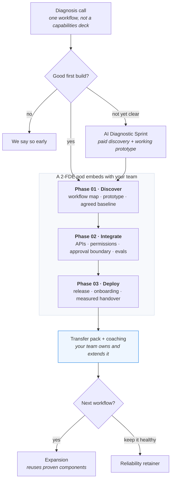
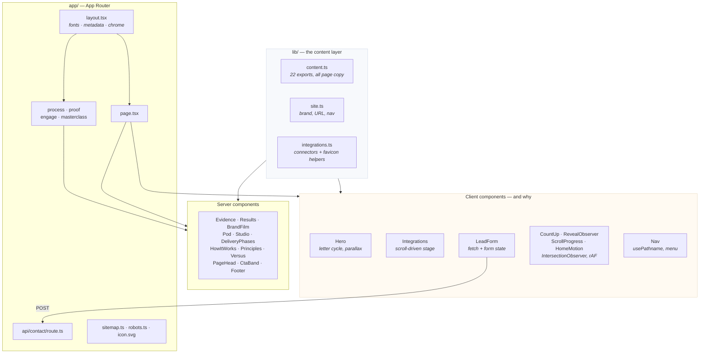
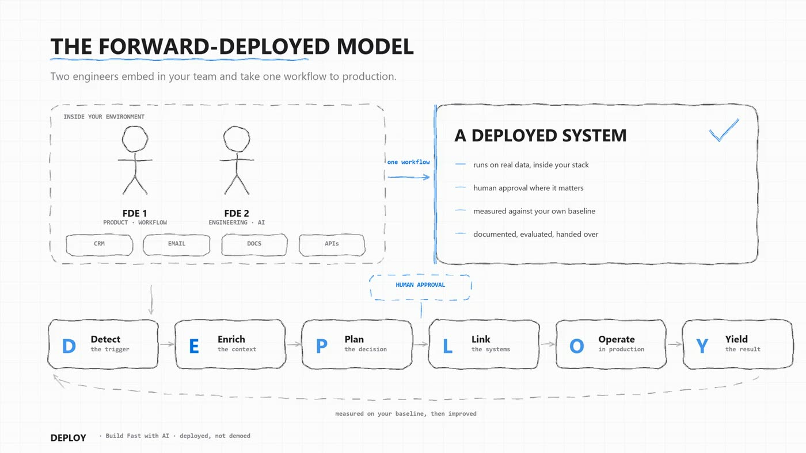
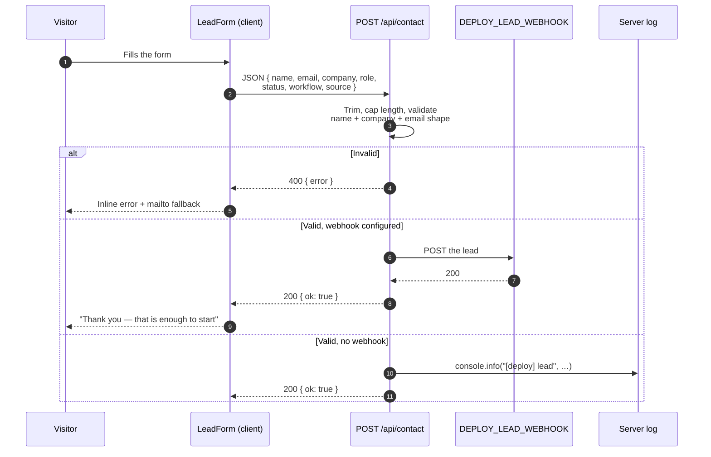
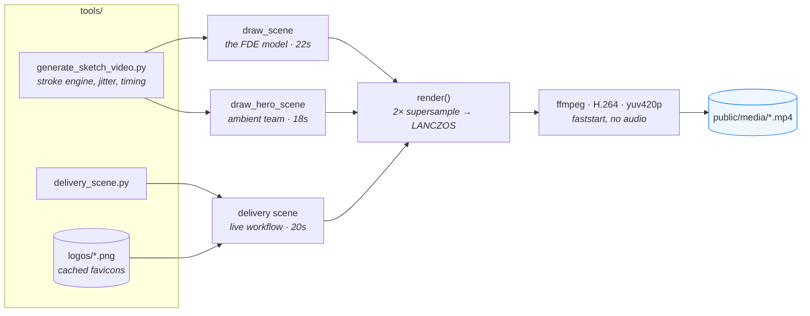
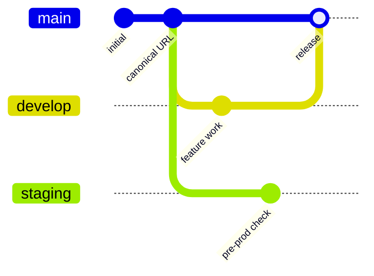

<div align="center">

# DEPLOY

**Two forward-deployed engineers. One business workflow. Taken from idea to a deployed production system.**

Marketing site for DEPLOY by Build Fast with AI.

[](https://deploypro-zeta.vercel.app)




</div>

---

## Contents

- [What this is](#what-this-is)
- [The product workflow](#the-product-workflow)
- [The delivery engagement](#the-delivery-engagement)
- [Site architecture](#site-architecture)
- [The page, section by section](#the-page-section-by-section)
- [Lead capture](#lead-capture)
- [Generated media](#generated-media)
- [Quick start](#quick-start)
- [Editing the copy](#editing-the-copy)
- [Content rules](#content-rules)
- [Configuration](#configuration)
- [Deployment](#deployment)
- [Project structure](#project-structure)
- [Design system](#design-system)
- [Before you launch](#before-you-launch)

---

## What this is

A five-page marketing site aimed at one reader: a CTO, CIO or VP Engineering at a mid-to-large
company whose AI initiatives have not reached production.

Static site, one dynamic endpoint. No CMS, no database, no UI framework — three runtime
dependencies (`next`, `react`, `react-dom`) and roughly 113 kB of first-load JavaScript.

| Route | What it argues |
| --- | --- |
| `/` | The execution gap is real, we have shipped through it, and here is exactly how |
| `/process` | Detect → Yield, the deliverables, and what "production" actually means |
| `/proof` | Delivered systems with numbers, plus sector-by-sector evidence |
| `/engage` | The offer ladder, who this is for, and who it is not for |
| `/masterclass` | A free monthly session, minute by minute, with registration |

---

## The product workflow

This is the thing the site sells. Every deployed workflow follows the same loop, and the
human-approval boundary sits in the middle by design rather than bolted on at the end.



The home page renders this as an animated sketch, with the real products a workflow reads from and
writes to:



---

## The delivery engagement

How a build runs, from first conversation to handover. Note the deliberate absence of any timeline —
see [Content rules](#content-rules).



---

## Site architecture

Server components render everything by default. Five components opt into the client, each for one
specific browser API.



**Why so little client JavaScript.** Copy is data, not markup, so every section is a server
component reading from `lib/content.ts`. The interactive parts are isolated: a scroll observer, a
counter, a form. Nothing else reaches the browser.

---

## The page, section by section

The home page is an argument in order. Each section answers the objection the previous one raises.

| # | Section | Component | The job it does |
| --- | --- | --- | --- |
| 1 | Hero | `Hero` | The DEPLOY acronym cycles the loop; states the offer |
| 2 | The execution gap | `Evidence` | Six cited statistics. *You are not an outlier — this is the norm* |
| 3 | Delivered results | `Results` | 80% · 60% · 45% · 1,000+. *But it can be done, and we have* |
| 4 | Worked with | `BrandFilm` | Partner logos and the delivery credentials |
| 5 | The two-FDE pod | `Pod` | The model, drawn out, plus who owns what |
| 6 | DEPLOY Studio | `Studio` | Eight reusable blocks. *Why two of us beat five of yours* |
| 7 | Integrations | `Integrations` | *Nothing gets migrated* — the stack objection |
| 8 | Three phases | `DeliveryPhases` | A scroll-filled rail: Discover → Integrate → Deploy |
| 9 | Inside a live workflow | `HowItWorks` | The mechanism: trigger, systems, approval, result |
| 10 | Use Less AI | `Principles` | The engineering position that earns a CTO's trust |
| 11 | vs building in-house | `Versus` | The real alternative, argued honestly |
| 12 | Start a conversation | `FinalCta` | The five diagnosis questions, then the form |



---

## Lead capture

One endpoint, no database. It validates, then forwards to whatever webhook you configure.



`source` records which page produced the lead — `home`, `process`, `proof`, `engage` or
`masterclass` — so you can see which argument converts.

> [!IMPORTANT]
> With no `DEPLOY_LEAD_WEBHOOK` set, submissions succeed but reach only the server log. Set it
> before driving traffic here.

---

## Generated media

The three films are **not stock footage**. They are drawn frame by frame with Pillow and encoded
with ffmpeg, from one script. That keeps them on-brand, editable in version control, and small —
1.75 MB for all three, against roughly 5 MB for the stock clips they replaced.



```bash
python tools/generate_sketch_video.py      # needs Pillow, numpy and ffmpeg on PATH
```

| File | Scene | Where it appears |
| --- | --- | --- |
| `hero-loop.mp4` | `draw_hero_scene` | Behind the hero copy — faint, weighted to the edges |
| `fde-sketch.mp4` | `draw_scene` | The two-FDE model section |
| `delivery-sketch.mp4` | `delivery_scene.py` | "Inside a live workflow", with real product logos |

Each stroke is a polyline that is resampled, given seeded perpendicular jitter and drawn in two
passes, so straight lines read as hand-drawn. Reveal is a fraction of total path length driven by
`seg(t, start, end)`. All three loop seamlessly via a fade at the seam.

> [!NOTE]
> The script reads fonts from `C:\Windows\Fonts`. Change `FONT_DIR` to render on macOS or Linux.

---

## Quick start

```bash
npm install
npm run dev          # http://localhost:3000
```

| Script | Does |
| --- | --- |
| `npm run dev` | Dev server with fast refresh |
| `npm run build` | Production build |
| `npm run start` | Serve the production build |
| `npm run typecheck` | `tsc --noEmit` |
| `npm run lint` | Next.js lint |

> [!WARNING]
> Do not run `npm run build` while `npm run dev` is running. Both write to `.next`, and the build
> overwrites chunks the dev server is still serving — you get
> `__webpack_modules__[moduleId] is not a function`. If it happens: stop dev, `rm -rf .next`, restart.

---

## Editing the copy

Almost all text lives in `lib/content.ts` as typed data, not inside components. Change the data and
every page that uses it follows.

| Export | Feeds |
| --- | --- |
| `problemStats` | The execution-gap statistics |
| `headlineResults` | The four counted-up result figures |
| `credentials` | 500+ / 150+ / 15,000+ / 40,000+ |
| `podRoles` | FDE 1 and FDE 2 |
| `studioBlocks` | The eight Studio capability blocks |
| `useLessAI` | The four engineering principles |
| `versusInHouse` | The in-house comparison table |
| `deploySteps` | Detect → Yield, used by the hero *and* `/process` |
| `deliverables`, `productionStandard`, `scopeDiscipline`, `bothSides`, `whereItApplies` | `/process` |
| `caseStudies`, `sectorProof`, `proofTypes` | `/proof` |
| `offers`, `fitCriteria`, `notAFit`, `objections` | `/engage` |
| `masterclass` | `/masterclass` |
| `diagnosisQuestions` | The final CTA |

Brand, canonical URL, contact email and the nav live in `lib/site.ts`. The connector list and the
favicon helper live in `lib/integrations.ts`. Partner logos are static files in `public/logos/`.

---

## Content rules

Two constraints were set deliberately. Both are easy to break by accident.

**No delivery-timeline claim.** No "3 weeks", no "4–8 weeks", no "in weeks". The source Business
Plan and the original site disagreed on the number, so timing was dropped entirely rather than
guessed. Putting one back is a business decision, not a copy edit.

**No pricing figures.** `/engage` describes six offers and states that numbers come on the diagnosis
call. The only `₹` on the site is a public third-party statistic about Bajaj Finance on `/proof`.

Before shipping a copy change:

```bash
npm run build && npm run start
curl -s http://localhost:3000/engage | grep -oiE "₹|lakh|LPA|[0-9]+.?weeks?"
```

**Illustrative figures must be labelled as such.** Anything that is not delivered client work says
so on the page. The delivered work, with real numbers, lives in `caseStudies` and `headlineResults`.

---

## Configuration

```bash
cp .env.example .env.local
```

| Variable | Required | Purpose |
| --- | --- | --- |
| `DEPLOY_LEAD_WEBHOOK` | No | Where leads are forwarded. Any endpoint accepting a JSON POST — Zapier, Make, a Slack workflow, a CRM webhook. Unset means log-only. |

On Vercel:

```bash
vercel env add DEPLOY_LEAD_WEBHOOK production
```

---

## Deployment

Hosted on Vercel, built from `main`.



| Branch | Role |
| --- | --- |
| `main` | Production. Vercel deploys every push. |
| `develop` | Integration branch for ongoing work. |
| `staging` | Pre-production verification. |

```bash
vercel deploy --prod     # manual production deploy
vercel inspect <url>     # check status
```

Static pages are prerendered at build; `/api/contact` runs on the Node.js runtime. `next.config.mjs`
sets a one-year immutable cache on `/media/*`, since the films are content-addressed by name.

---

## Project structure

```
deploy-web/
├─ app/
│  ├─ layout.tsx              fonts, metadata, skip link, chrome
│  ├─ page.tsx                the twelve home sections, in order
│  ├─ globals.css             the whole design system, one file
│  ├─ icon.svg                favicon
│  ├─ not-found.tsx           404
│  ├─ robots.ts · sitemap.ts  generated at build
│  ├─ process/ proof/ engage/ masterclass/
│  └─ api/contact/route.ts    lead endpoint
├─ components/                21 components — 5 client, 16 server
├─ lib/
│  ├─ content.ts              22 exports: every word of body copy
│  ├─ integrations.ts         connectors, favicons, system→logo map
│  └─ site.ts                 brand, canonical URL, nav
├─ public/
│  ├─ media/                  three generated MP4s
│  └─ logos/                  partner logos
├─ tools/
│  ├─ generate_sketch_video.py
│  ├─ delivery_scene.py
│  └─ logos/                  cached favicons for the sketch
└─ docs/                      README stills
```

---

## Design system

Everything lives in `app/globals.css`, layered in versioned blocks so later overrides stay
traceable.

**Type.** Three faces via `next/font`, self-hosted, zero layout shift.

| Face | Variable | Used for |
| --- | --- | --- |
| Inter Tight | `--font-display` | Headlines, figures, the DEPLOY letters |
| Inter | `--font-inter` | Body |
| JetBrains Mono | `--font-mono` | Kickers, chips, numeric markers, form labels |

**Colour.** `--ink #171719` · `--muted #5f5f64` · `--blue #0071e3` · `--blue-2 #5d5fef` ·
`--off #f4f4f6`. Two dark bands — the execution gap and DEPLOY Studio — split the page into three
acts, and no two identical greys sit adjacent.

**Motion.** Staggered reveals through one `IntersectionObserver`, scroll-driven choreography in
`HomeMotion`, self-drawing rules, and a logo marquee that pauses on hover. Every animation is
disabled under `prefers-reduced-motion: reduce`, including the JavaScript-driven ones.

**Accessibility.** Skip link, visible focus rings, live regions on the hero cycle and the form
status, semantic landmarks, and real figures in the HTML before any counter animates — so crawlers
and no-JS visitors see `80%`, never `0%`.

---

## Before you launch

- [ ] Confirm `contactEmail` in `lib/site.ts` — currently a placeholder
- [ ] Confirm `url` in `lib/site.ts` if a custom domain is attached
- [ ] Set `DEPLOY_LEAD_WEBHOOK` so leads reach a human
- [ ] Submit the form on the live site and confirm the lead arrives
- [ ] Check the reduced-motion path (macOS: System Settings → Accessibility → Display)

---

<div align="center">

**Build Fast with AI** · Founded by IIT Delhi alumni · *Deployed, not demoed.*

</div>
